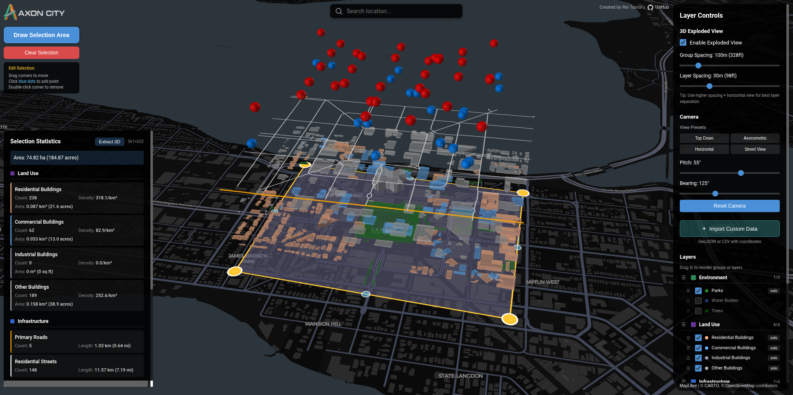

<p align="center">
  
</p>

<p align="center">
  <strong>An interactive exploded axonometric map visualization tool for exploring urban spatial data</strong>
</p>

<p align="center">
  <a href="#features">Features</a> •
  <a href="#quick-start">Quick Start</a> •
  <a href="#usage">Usage</a> •
  <a href="#for-developers">For Developers</a> •
  <a href="#license">License</a>
</p>

<p align="center">
  
  
  
  
</p>

---

<p align="center">
  
</p>

## Features

### 🗺️ Interactive Map Selection
- Draw custom polygon areas on the map to define your region of interest
- Edit selection by dragging vertices, adding new points, or removing existing ones
- Search for any location worldwide using the integrated search bar

### 🏙️ Exploded Axonometric View
- Visualize urban layers separated vertically in an exploded diagram style
- Toggle between flat and exploded views with adjustable layer spacing
- Layers grouped by category: Environment, Land Use, Infrastructure, Access & Transit, and Traffic Control

### 🎮 3D Extracted View
- Dedicated 3D viewer with orbit controls for detailed exploration
- Interactive layer group toggles
- Click features to pin information cards
- Save high-quality screenshots with location labels

### 📡 Real-time OpenStreetMap Data
- Fetches live data from OpenStreetMap's Overpass API
- Automatic feature clipping to selection polygon
- Statistics calculation (count, density, area, length) per layer

### 📂 Custom Data Import
- Upload your own GeoJSON or CSV files as custom layers
- Auto-detection of coordinate columns in CSV files
- Zoom-to-extent functionality for imported data

---

## Quick Start

### Prerequisites
- Node.js 18+
- npm or yarn

### Installation

```bash
# Clone the repository
git clone https://github.com/raynbowy23/Axon-City.git
cd Axon-City

# Install dependencies
npm install

# Start development server
npm run dev
```

The application will be available at `http://localhost:5173`

---

## Usage

1. **Search for a location** using the search bar at the top
2. **Click "Draw Selection Area"** to start drawing a polygon
3. **Click on the map** to add points (minimum 3 required)
4. **Press Enter** to complete drawing
5. **Wait for data to load** from OpenStreetMap
6. **Explore** using the control panel:
   - Toggle layer visibility
   - Adjust exploded view settings
   - Reorder layers via drag-and-drop
7. **Open Extracted View** for 3D exploration
8. **Save screenshots** with the Save Image button

### Keyboard Shortcuts

| Key | Action |
|-----|--------|
| `Enter` | Complete polygon drawing |
| `Escape` | Cancel drawing |
| `Ctrl+Z` | Undo last point |

### Editing Selection

- **Drag vertices** to reshape the polygon
- **Click blue midpoints** to add new vertices
- **Double-click vertices** to remove them

---

## Layer Groups

| Group | Description | Example Layers |
|-------|-------------|----------------|
| Environment | Natural features | Parks, water bodies, trees |
| Land Use | Buildings by type | Residential, commercial, industrial |
| Infrastructure | Roads and crossings | Primary roads, residential streets, bike lanes, crosswalks |
| Access & Transit | Transportation | Transit stops, rail lines, parking |
| Traffic Control | Traffic devices | Traffic signals |

---

## For Developers

### Tech Stack

- **React 19** - UI framework
- **TypeScript** - Type safety
- **Vite** - Build tool and dev server
- **deck.gl** - WebGL-powered map visualization
- **MapLibre GL** - Base map rendering
- **Turf.js** - Geospatial analysis
- **Zustand** - State management
- **dnd-kit** - Drag and drop functionality

### Project Structure

```
src/
├── components/           # React components
│   ├── MapView.tsx       # Main map with deck.gl layers
│   ├── ExtractedView.tsx # 3D extracted view
│   ├── ControlPanel.tsx  # Layer controls
│   ├── StatsPanel.tsx    # Statistics display
│   ├── DataInputPanel.tsx# Custom data import
│   └── ...
├── data/
│   └── layerManifest.ts  # Layer definitions
├── hooks/                # Custom React hooks
├── store/
│   └── useStore.ts       # Zustand state management
├── types/
│   └── index.ts          # TypeScript definitions
└── utils/
    ├── osmFetcher.ts     # Overpass API client
    ├── geometryUtils.ts  # Spatial operations
    └── csvParser.ts      # CSV to GeoJSON converter
```

### Build for Production

```bash
npm run build
npm run preview
```

### Contributing

Contributions are welcome! Please feel free to submit a Pull Request.

1. Fork the repository
2. Create your feature branch (`git checkout -b feature/amazing-feature`)
3. Commit your changes (`git commit -m 'Add some amazing feature'`)
4. Push to the branch (`git push origin feature/amazing-feature`)
5. Open a Pull Request

---

## License

This project is licensed under the Apache License 2.0 - see the [LICENSE](LICENSE) file for details.

## Acknowledgments

- Map data from [OpenStreetMap](https://www.openstreetmap.org/) contributors
- Base map tiles from [MapLibre](https://maplibre.org/)
- Visualization powered by [deck.gl](https://deck.gl/)

---

<p align="center">
  Created by <a href="https://github.com/raynbowy23">Rei Tamaru</a>
</p>

<p align="center">
  <a href="https://github.com/raynbowy23/Axon-City">
    
  </a>
</p>
