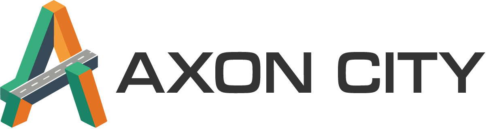
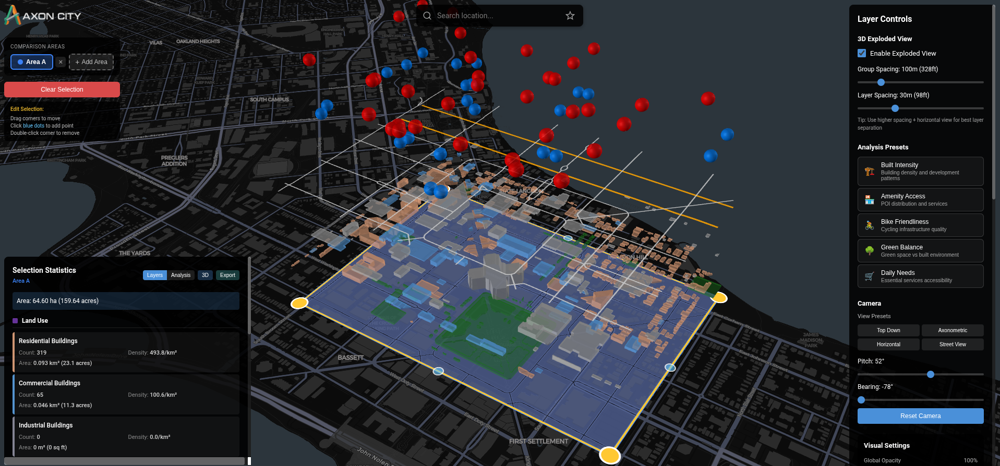

<p align="center">
  
</p>

<p align="center">
  <strong>An interactive exploded axonometric map visualization tool for exploring and comparing urban spatial data</strong>
</p>

<p align="center">
  <a href="#features">Features</a> •
  <a href="#quick-start">Quick Start</a> •
  <a href="#usage">Usage</a> •
  <a href="#license">License</a>
</p>

<p align="center">
  
  
  
  
</p>

---

<p align="center">
  
</p>

## What is AxonCity?

AxonCity is a web-based urban analysis tool that transforms OpenStreetMap data into interactive 3D exploded axonometric visualizations. Simply draw an area on the map, and AxonCity fetches real-time urban data, such as buildings, roads, parks, transit stops, and more. Then displays them as separated vertical layers for easy exploration.

Compare multiple neighborhoods side-by-side, analyze urban metrics like Walk Score and building density, and export your findings as PDF reports, CSV data, or shareable images. Whether you're an urban planner, researcher, or curious explorer, AxonCity helps you understand the spatial composition of any city in the world.

## Features

**🗺️ Interactive Map Selection**: Draw custom areas using polygon, rectangle, or circle tools with editable vertices, location search, and multiple map styles.

**🏙️ Multi-Area Comparison**: Select and compare multiple neighborhoods simultaneously with side-by-side statistics and easy area switching.

**📊 Urban Metrics & Analysis**: Analyze Walk Score, Transit Score, Bike Score, Green Space Ratio, Building Density, and Mixed-Use Score for any selected area.

**🎮 3D Exploded View**: Explore urban layers in a vertically separated axonometric view with orbit controls and pinnable feature info cards.

**📤 Export & Sharing**: Export your analysis as PDF reports, CSV/JSON data, or PNG screenshots, and generate shareable URLs.

**📡 Real-time Data**: Fetch live OpenStreetMap data via Overpass API with automatic clipping, layer statistics, and optimized caching.

**📂 Custom Data Import**: Upload your own GeoJSON or CSV files as custom layers with auto-detected coordinates and custom colors.

**📱 Mobile Support**: Fully responsive design with touch-friendly drawing and loading indicators for mobile devices.

## Quick Start

### Prerequisites
- Node.js 18+
- npm or yarn

### Installation

```bash
# Clone the repository
git clone https://github.com/raynbowy23/Axon-City.git
cd Axon-City

# Install dependencies
npm install

# Start development server
npm run dev
```

The application will be available at `http://localhost:5173`

## Usage

### Basic Workflow

1. **Search for a location** using the search bar at the top
2. **Select a drawing mode** - Polygon, Rectangle, or Circle
3. **Draw your area** on the map
4. **Click Complete** to finish drawing
5. **Wait for data to load** from OpenStreetMap
6. **Explore** using the control panel:
   - Toggle layer visibility
   - Adjust exploded view settings
   - Reorder layers via drag-and-drop
7. **View Metrics** in the Stats panel for urban analysis
8. **Export** your analysis as PDF, CSV, or PNG

### Multi-Area Comparison

1. Draw your first area and wait for data to load
2. Click **"Draw Selection Area"** again to add another area
3. Click on any drawn area to switch between them
4. Open the **Stats panel** to compare metrics across areas
5. Use the **Extracted View** for 3D comparison with sync/separate modes

### Keyboard Shortcuts

| Key | Action |
|-----|--------|
| `Enter` | Complete polygon drawing |
| `Escape` | Cancel drawing |
| `Ctrl+Z` | Undo last point |

### Editing Selection

- **Drag vertices** to reshape the polygon
- **Click blue midpoints** to add new vertices
- **Double-click vertices** to remove them
- For rectangles and circles, dragging vertices maintains the shape type

## Layer Groups

| Group | Description | Example Layers |
|-------|-------------|----------------|
| Environment | Natural features | Parks, water bodies, trees |
| Land Use | Buildings by type | Residential, commercial, industrial |
| Infrastructure | Roads and crossings | Primary roads, residential streets, bike lanes, crosswalks |
| Access & Transit | Transportation | Transit stops, rail lines, parking |
| Traffic Control | Traffic devices | Traffic signals |

## License

This project is licensed under the Apache License 2.0 - see the [LICENSE](LICENSE) file for details.

## Acknowledgments

- Map data from [OpenStreetMap](https://www.openstreetmap.org/) contributors
- Base map tiles from [CARTO](https://carto.com/) and [ESRI](https://www.esri.com/)
- Visualization powered by [deck.gl](https://deck.gl/) and [MapLibre](https://maplibre.org/)

<p align="center">
  Created by <a href="https://github.com/raynbowy23">Rei Tamaru</a>
</p>

<p align="center">
  <a href="https://github.com/raynbowy23/Axon-City">
    
  </a>
</p>
